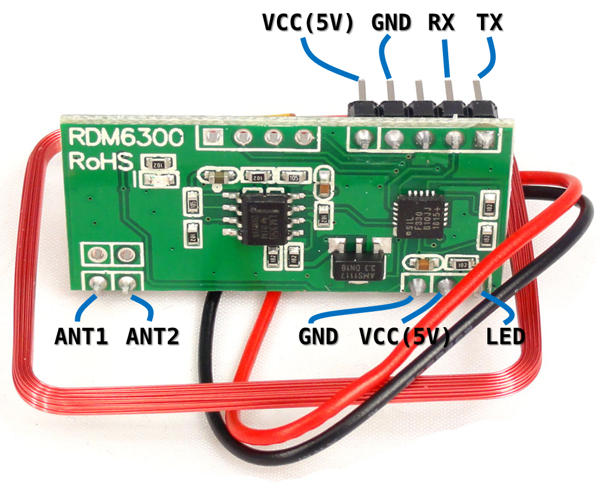
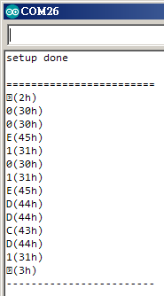
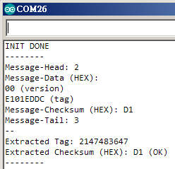

# rfid-access-control
Door Access Control System (using RDM6300 125KHz RFID reader module)

## Arduino

### ReadCardID

### RDM6300ReadTag

## Linux

	[19:04:13 (master) linux] $ ls
	Makefile  rfid-serial.c
	[19:04:13 (master) linux] $ make     
	[19:04:18 (master) linux] $ ls
	Makefile  rfid-serial  rfid-serial.c  rfid-serial.o
	[19:04:18 (master) linux] $ sudo ./rfid-serial 
	buffer=[00E101EDDCD1], res=14
	buffer[00]=[]	02h
	buffer[01]=[0]	30h
	buffer[02]=[0]	30h
	buffer[03]=[E]	45h
	buffer[04]=[1]	31h
	buffer[05]=[0]	30h
	buffer[06]=[1]	31h
	buffer[07]=[E]	45h
	buffer[08]=[D]	44h
	buffer[09]=[D]	44h
	buffer[10]=[C]	43h
	buffer[11]=[D]	44h
	buffer[12]=[1]	31h
	buffer[13]=[]	03h
	--------
	Message-Head:   02h
	Message-Data:   00 (version) + E101EDDC (tag)
	Message-ChkSum: D1
	Message-Tail:   03h
	--------
	Extract-ChkSum: D1 (OK)